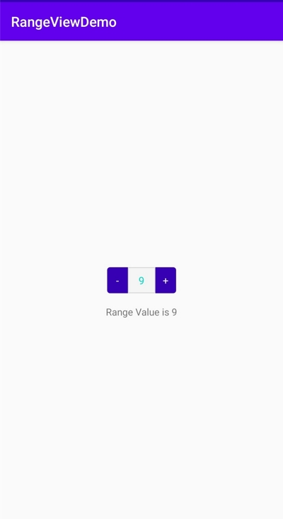

# RangeView

Simple Number Picker widget

## Getting Started

Simply add rangeview module into your project and you can use CustomRangeView in your layout.

## Example
```
  <com.vin.rangeview.view.CustomRangeView
        android:id="@+id/crvDemo"
        android:layout_width="100dp"
        android:layout_height="40dp"
        app:minRange="2"
        app:maxRange="10"/>
```

```
  findViewById<CustomRangeView>(R.id.crvDemo).onRangeValueChangeListener = object : OnRangeValueChangeListener {
      override fun onValueChanged(oldValue: Int, newValue: Int) {
          tvRange.text = "Range Value is $newValue"
      }

      override fun onError(error: ERROR) {
          Toast.makeText(this@MainActivity, error.name, Toast.LENGTH_SHORT).show()
      }
  }
```
## Screen



## License

This project is licensed under the MIT License - see the [LICENSE](LICENSE) file for details
